# REDDIT

## 1. Introduction

This project create a website base on [Reddit](https://www.reddit.com), a social network platform. The website focus on allowing everyone to share their contents with each other, and express their opinion. 

Live demo: https://reddit.trxyzng.lovestoblog.com

The front-end part can be found here: [frontend_github_link](https://github.com/Trxyzng37/angular)

The back-end part can be found here: [backend_github_link](https://github.com/Trxyzng37/spring)

## 2. Technologies

- The website use [Angular](https://angular.dev) for the front-end, and [Spring](https://spring.io) for back-end.
- [PostgreSQl](https://www.postgresql.org) is used to store data about users, posts, and communities.
- [MongoDB](https://www.mongodb.com) is used to store data about comments.
- [Cloudary](https://cloudinary.com) is used to store images and videos.

## 3. Functions

The website has the following functions:
- User can sign-up and sign-in using username password, or using Google account.
- User can create, edit, delete posts, communities and comments.
- User can search for communities or other people using name.
- User can sort posts's order base on time and upvote numbers.
- User can upvote or downvote a post, and save post to view later.
- Moderator of a community can control either a post is allowed or not in a community.

*Community*: community is a place where user can submit content that follow the community's interest. A community is created by a user, and the user is also have the ability to control which content can be shown on the community by moderate it.

*Post*: post is a piece of content that is submitted to the website. A post can be text, image, video or link. post can be created and submitted to a community by any user.

## 4. Build and run the application locally
You can run the application locally by using Docker and Docker compse. Simply follow the below steps:

1. Clone the repository: `https://github.com/Trxyzng37/reddit.git`

2. Go to the project's folder and open the command prompt.

3. Pull the submodules content: `git submodule update --init --recursive`

<!-- 4. Update the submodules content to lastest commit: `git submodule update --remote --merge` -->

4. Run the application using Docker compose: `docker-compose up --build`

The project website will be available at: [http://127.0.0.1:4200](http://127.0.0.1:4200)

## 5. Demonstration

#### 5.1. Create an account

An account can be created by using an email and password, or using Google sign-in.

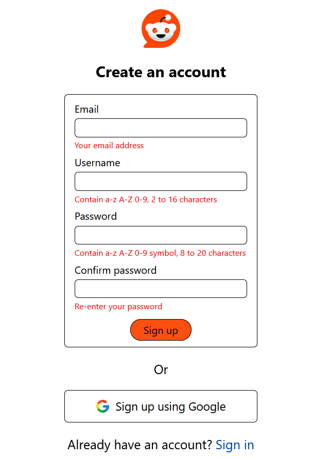

- If using email and password, check the email for a passcode to confirm the sign-up.

- If using Google sign-in, after successfully sign-up, a page will show up to let you choose username.

#### 5.2. Login

After create an account successfully, you can login using:
- Email or username with password.
- Google sign-in.

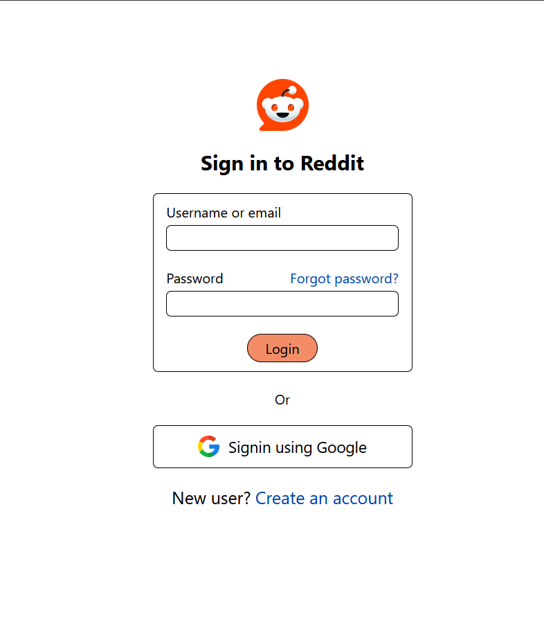

#### 5.3. Home page, popular page

Home page: show posts from communities that you have joined.
Popular page: show posts from all communities.

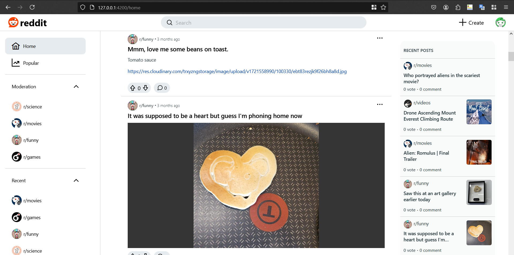

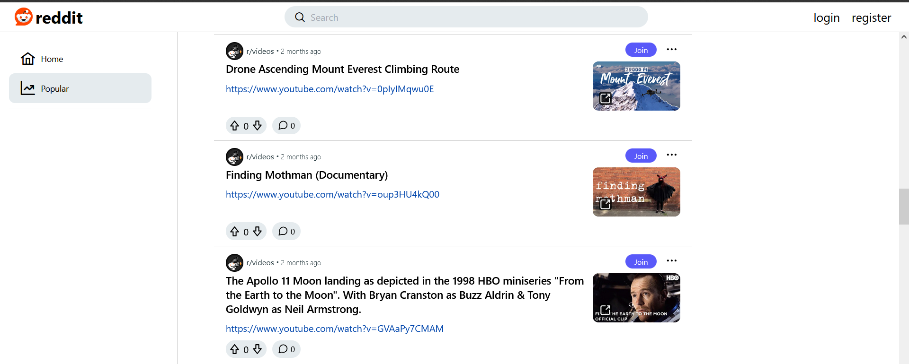

#### 5.4. View post page

This page show the detail view of a post, which you can vote the post, or create comments.

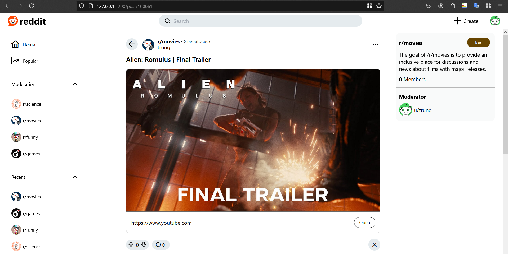

#### 5.5. Community page

This page let you view all posts from a specific community.

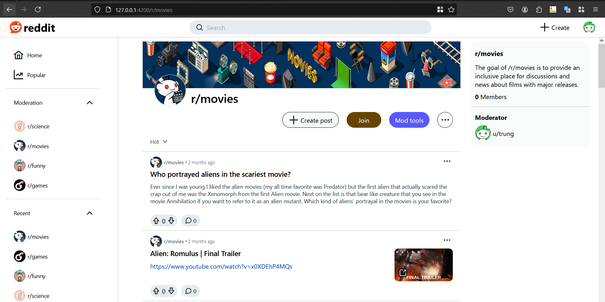

#### 5.6. Create community

You can open the popup using the create community button on the left navigation bar. 
This popup allow you to create a community by specify the name, description, avatar, banner and scope of the community. 

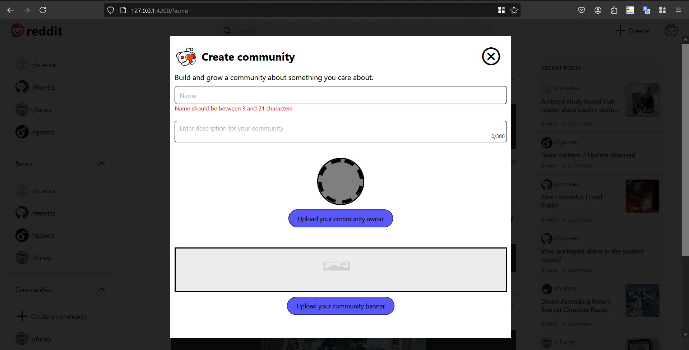

#### 5.7. Create post page

This page allow you to create post, which can be submit to community that you choose.
To create a post, a community need to be selected, and a title must be provided.

- Post: allow formatted text and images.
- Image: only allow images.
- Video: allow submit a video.
- Link: allow submit a link.

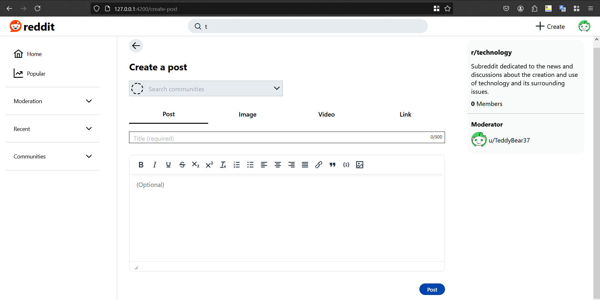

#### 5.8. Moderation page

This page allow you to control what posts are allowed in your community.

- Need review: show posts that have not been approved or removed by the moderator yet.
- Approved: show posts that have been approved by the moderator.
- Removed: show posts that have been removed by the moderator.
- Editted: show posts that have been editted by the original poster. 

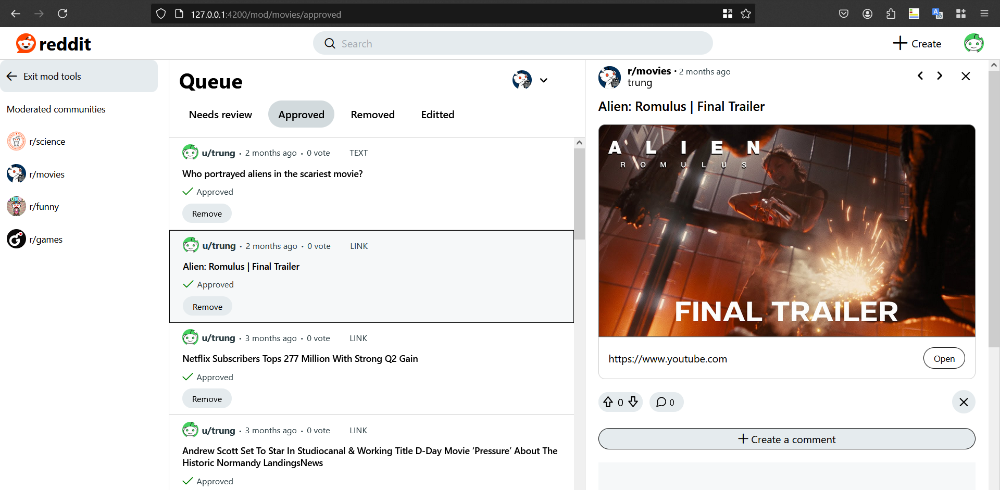

#### 5.9. User profile page

This page show the information of a user, as well as posts and comments that the user has posted on the site.

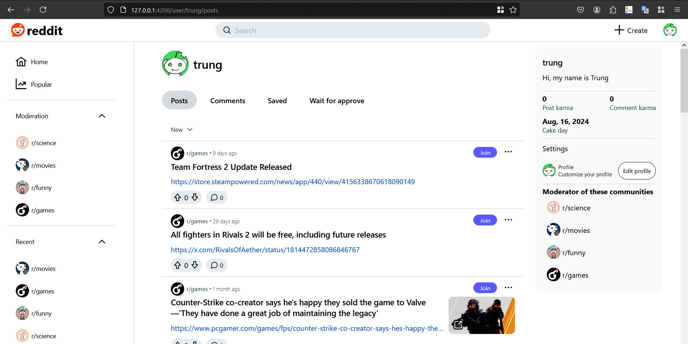

#### 5.10. User profile setting

This page allow you to change your user settings, including the decription and avatar.

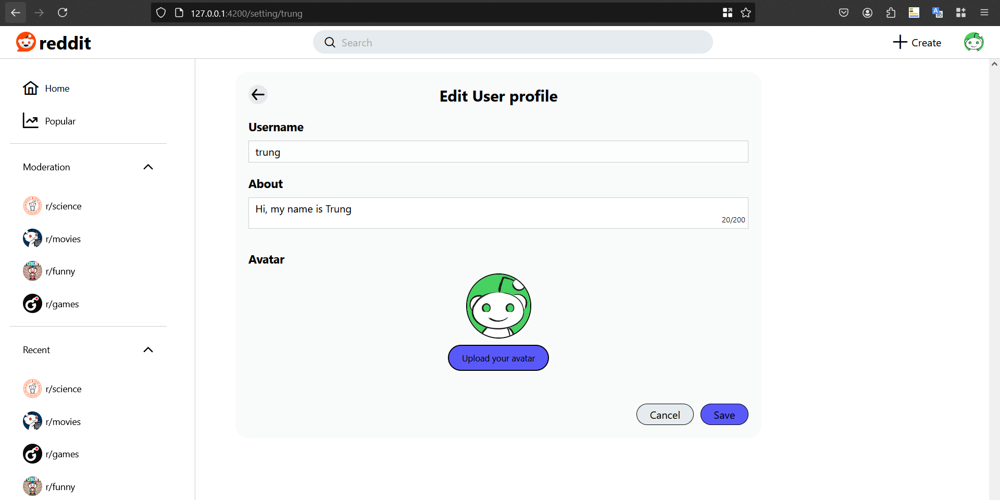

#### 5.11. Community setting

This page allow you to change your community settings, including:

- Changing the description, icon, banner and scope of community.
- Delete the community, which also delete all posts belong to the community.

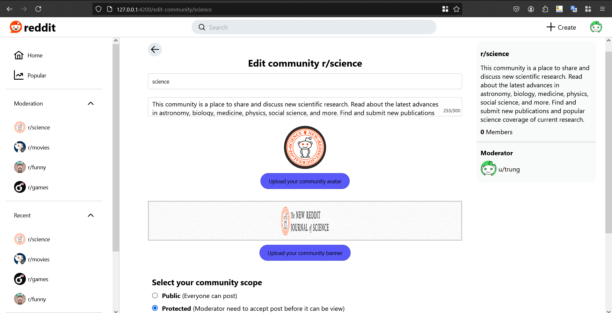

#### 5.12. Search page

This page show you the results of a search term, including posts, communities, and users.

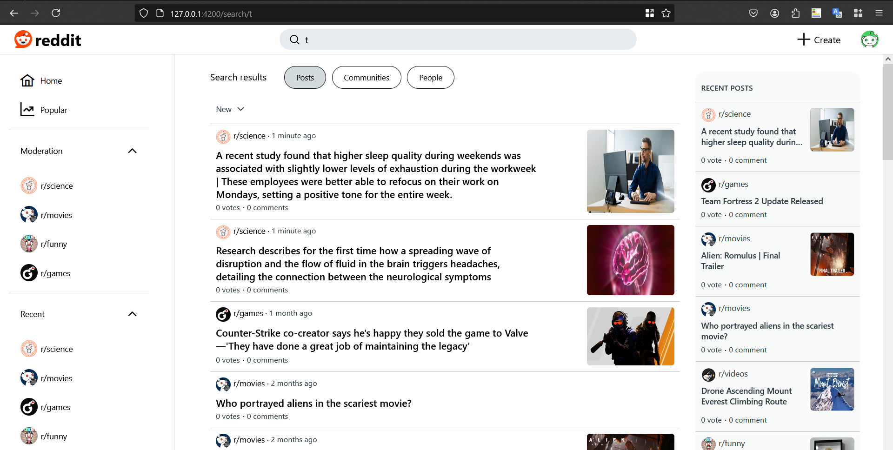

